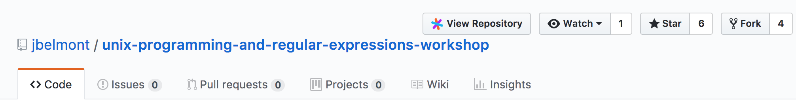
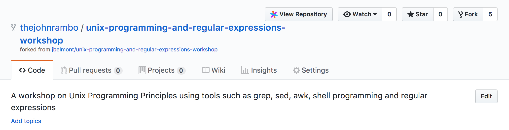
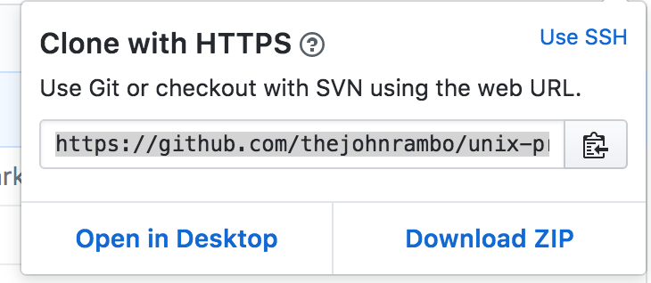
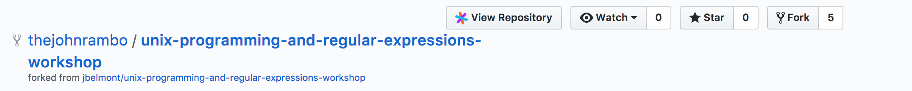
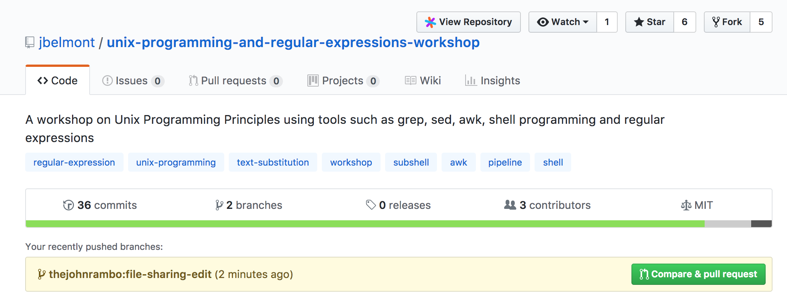
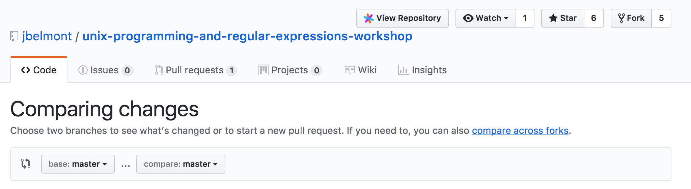
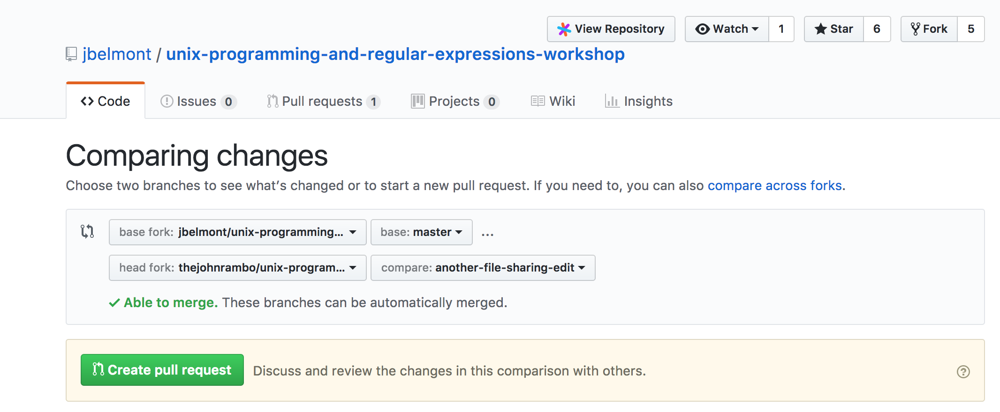
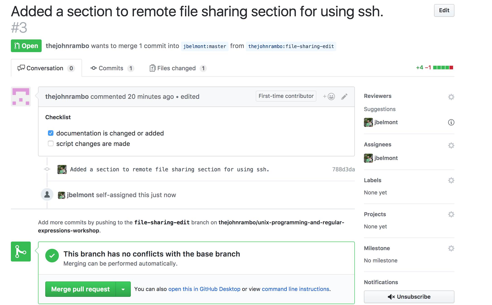
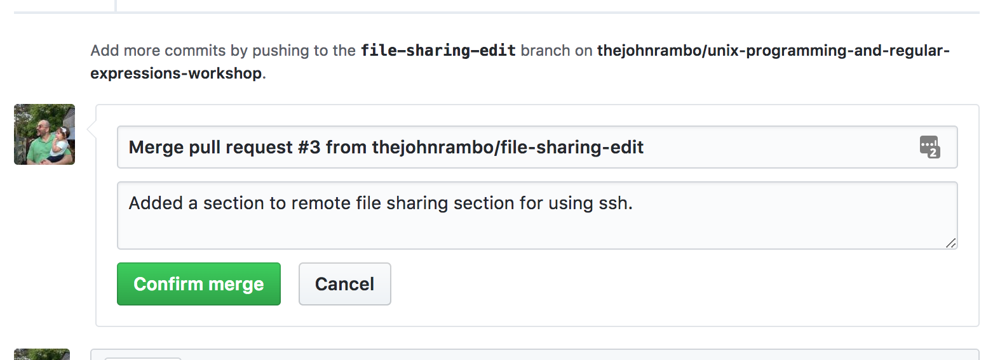

# Contributing to Unix Programming and Regular Expressions Workshop

Contributions to this workshop may come in many forms. Some contribute code changes,
others contribute docs.

No contribution is too small and all contributions are valued.

This guide details the basic steps for getting started contributing to the unix workshop GitHub Repository and describes what to expect throughout each step of the process.

## Submitting a Pull Request

#### Setting up your local environment

To get started, you will need to have `git` installed locally. Depending on
your operating system, there are also a number of other dependencies required.

Once you have `git` and are sure you have all of the necessary dependencies,
it's time to create a fork.

Before getting started, it is recommended to configure `git` so that it knows
who you are:

```text
$ git config --global user.name "John Rambo"
$ git config --global user.email "john.rambo@hero.net"
```
Please make sure this local email is also added to your
[GitHub email list](https://github.com/settings/emails) so that your commits
will be properly associated with your account and you will be promoted
to Contributor once your first commit is landed.

#### Step 1: Fork

Fork the project [on GitHub](https://github.com/jbelmont/unix-programming-and-regular-expressions-workshop) and clone your fork locally.



When the fork is complete you will see the following screen



```text
$ git clone git@github.com:jbelmont/unix-programming-and-regular-expressions-workshop.git
$ cd unix-programming-and-regular-expressions-workshop
$ git remote add upstream https://github.com/jbelmont/unix-programming-and-regular-expressions-workshop.git
$ git fetch upstream
```

#### Step 2: Branch

As a best practice to keep your development environment as organized as
possible, create local branches to work within. These should also be created
directly off of the `master` branch.

```text
$ git checkout -b my-branch -t upstream/master
```

#### The Process of Making Changes

###### Editing Files

This workshop has markdown files in the *docs* folder.

If you want to edit any doc files for the repository please do so in *docs* folder

For example if you wanted to fix errors in the `docs/history-substitution.md` then you would make document changes inside there.

###### Adding Files

The workshop has a corresponding Gitbook that is built using [Gitbook](https://toolchain.gitbook.com/)

If you add a *markdown file* in the _docs_ folder then you will need to update the *SUMMARY.md*

Contents of the *SUMMARY.md*

```markdown
## Unix Programming and Regular Expressions Workshop

* [Workshop Introduction](/README.md)
* [Basics of Shell Programming](docs/basics-of-shell-programming.md)
* [Introduction to Text Processing](docs/introduction-to-text-processing.md)
* [Text Searching](docs/text-searching.md)
* [Text Substitution](docs/text-substitution.md)
* [Filename expansions and globbing](docs/filename-expansions-and-globbing.md)
* [Working with Fields](docs/working-with-fields.md)
* [Text Sorting](docs/text-sorting.md)
* [Arithmetic Operations and variables](docs/arithmetic-operations-and-variables.md)
* [Decision Making and Exit Status](docs/decision-making-and-exit-status.md)
* [Looping](docs/looping.md)
* [Input and Output](docs/input-and-output.md)
* [Command Process Substitution](docs/command-process-substitution.md)
* [History Substitution](docs/history-substitution.md)
* [Evaluation Order](docs/evaluation-order.md)
* [Subshells](docs/subshells.md)
* [Shell Functions](docs/shell-functions.md)
* [Signal Handling](docs/signal-handling.md)
* [Working with Files](docs/working-with-files.md)
* [Building Command line applications](docs/building-command-line-applications.md)
```

When you add a file to the docs folder you will need to add the entry into the file above and the logical order you think it would go into. The easiest way to do to that is to copy one of the lines and edit Name and path.

Don't worry about generating the *Gitbook* once you have edited the docs file or you have added a new docs file and you have submitted your Pull Request and it is merged into master, I will do the following on my part.

My steps that you don't have to worry about:

1. Merge your Pull Request
2. Run `git pull` in my local branch
3. If you added a new file I will run the following script to update *Gitbook* Site
  1. `npm run docs:publish`

*package.json file*:

```json
{
  "name": "unix-programming-and-regular-expressions-workshop",
  "version": "1.0.0",
  "description": "A workshop on Unix Programming Principles using tools such as grep, sed, awk, shell programming and regular expressions",
  "main": "index.js",
  "scripts": {
    "docs:prepare": "gitbook install",
    "docs:build": "npm run docs:prepare && rm -rf _book && gitbook build",
    "docs:watch": "npm run docs:prepare && gitbook serve",
    "docs:publish": "npm run docs:build && cd _book && git init && git commit --allow-empty -m 'Update docs' && git checkout -b gh-pages && touch .nojekyll && git add . && git commit -am 'Update docs' && git push git@github.com:jbelmont/unix-programming-and-regular-expressions-workshop.git gh-pages --force"
  },
  "repository": {
    "type": "git",
    "url": "git+https://github.com/jbelmont/unix-programming-and-regular-expressions-workshop.git"
  },
  "keywords": [],
  "author": "Jean-Marcel Belmont <marcelbelmont@gmail.com>",
  "license": "MIT",
  "bugs": {
    "url": "https://github.com/jbelmont/unix-programming-and-regular-expressions-workshop/issues"
  },
  "homepage": "https://github.com/jbelmont/unix-programming-and-regular-expressions-workshop#readme",
  "devDependencies": {
    "gitbook": "^3.2.3",
    "gitbook-cli": "^2.3.2"
  }
}
```

You won't be able to run `npm run docs:publish` unless I give you admin rights to the repo but essentially I force push changes to github pages and the static website gets regenerated.

Notice that there is a script called **docs:publish* in the *scripts* section of *package.json*

##### Commit message guidelines

A good commit message should describe what changed and why.

1. The first line should:
   - contain a short description of the change
   - be 50 characters or less
   - be entirely in lowercase with the exception of proper nouns, acronyms, and
   the words that refer to code, like function/variable names

2. Keep the second line blank.
3. Wrap all other lines at 72 columns.

4. If your patch fixes an open issue, you can add a reference to it at the end
of the log. Use the `Fixes:` prefix and the full issue URL.

   Examples:
   - `Fixes: https://github.com/jbelmont/unix-programming-and-regular-expressions-workshop/issues/10`

Sample complete commit message:

```txt
Body of commit message is a few lines of text, explaining things
in more detail, possibly giving some background about the issue
being fixed, etc.

The body of the commit message can be several paragraphs, and
please do proper word-wrap and keep columns shorter than about
72 characters or so. That way, `git log` will show things
nicely even when it is indented.

Fixes: https://github.com/jbelmont/unix-programming-and-regular-expressions-workshop/issues/10
```

#### Step 5: Rebase

As a best practice, once you have committed your changes, it is a good idea
to use `git rebase` (not `git merge`) to synchronize your work with the main
repository.

```text
$ git fetch upstream
$ git rebase upstream/master
```

This ensures that your working branch has the latest changes from `nodejs/node`
master.

#### Step 7: Push

Once you are sure your commits are ready to go, begin the process of opening a Pull Request by pushing your working branch to your fork on GitHub.

```text
$ git push origin my-branch
```

#### Step 8: Opening the Pull Request

From within GitHub, opening a new Pull Request will present you with a template
that should be filled out:

```markdown
<!--
Thank you for your pull request. Please provide a description above and review
the requirements below.

Contributors guide: https://github.com/jbelmont/blob/master/CONTRIBUTING.md
-->

##### Checklist
<!-- Remove items that do not apply. For completed items, change [ ] to [x]. -->

- [ ] documentation is changed or added
- [ ] script changes are made
```

Please try to do your best at filling out the details, but feel free to skip
parts if you're not sure what to put.

Once opened, Pull Requests are usually reviewed within a few days.

#### Sample Pull Request

Steps I took for the Pull Request

I forked the [Unix and Regular Expressions Workshop](https://github.com/jbelmont/unix-programming-and-regular-expressions-workshop)


I then clicked the Clone or Download Button



I ran the following terminal commands:

* `git clone https://github.com/thejohnrambo/unix-programming-and-regular-expressions-workshop.git a-test-fork-repo`
  * This makes a local cloned copy of the repo
* `git remote add upstream https://github.com/jbelmont/unix-programming-and-regular-expressions-workshop.git`
  * This helps add and setup upstream changes for the fork
* `git fetch upstream`
  * This command will fetch all the branches for the upstream repository
  * In my case master and gh-pages branches
* `git checkout -b file-sharing-edit -t upstream/master`
  * This creates a new branch called *file-sharing-edit* with a target set to upstream master branch
* I then made my changes into fork via the *docs/remote-file-sharing-and-file-access.md* file
* Once done I committed my changes
* `git add .`
* `git commit -m 'Added a section to remote file sharing section for using ssh.'`
  * These commands add changes to be staged and then commit those changes
* `git push origin file-sharing-edit`
  * This pushes up the *file-sharing-edit* branch to github to the forked repository
  * If you have another github username you have to do the following:
    * `git config credential.helper ""` this will reset credentials stored locally
* If you go back to the root repository which is sitting at the top of the fork



Once you go back to the root you can do the Pull Request via 2 ways in Github UI:

1. Click the new link that shows up in the original repository
  1. 
  2. Click *Create Pull Request* Button
2. Click the Pull Request Link
  1. Click the *New Pull Request* Button
  2. 
  3. Click compare across forks
  4. 
    1. Notice here that there is a base fork which is *jbelmont/unix-programming-and-regular-expressions-workshop*
    2. And there is a head fork which is *thejohnrambo/unix-programming-and-regular-expressions-workshop*
  5. Click *Create pull request*

Once the changes are reviewed and merged then I will run `npm run docs:publish` so that they get published to gitbook.

When I login I will be able to merge and assign Pull Request to others



The second to last step is to merge the changes with *Merge pull request* button


