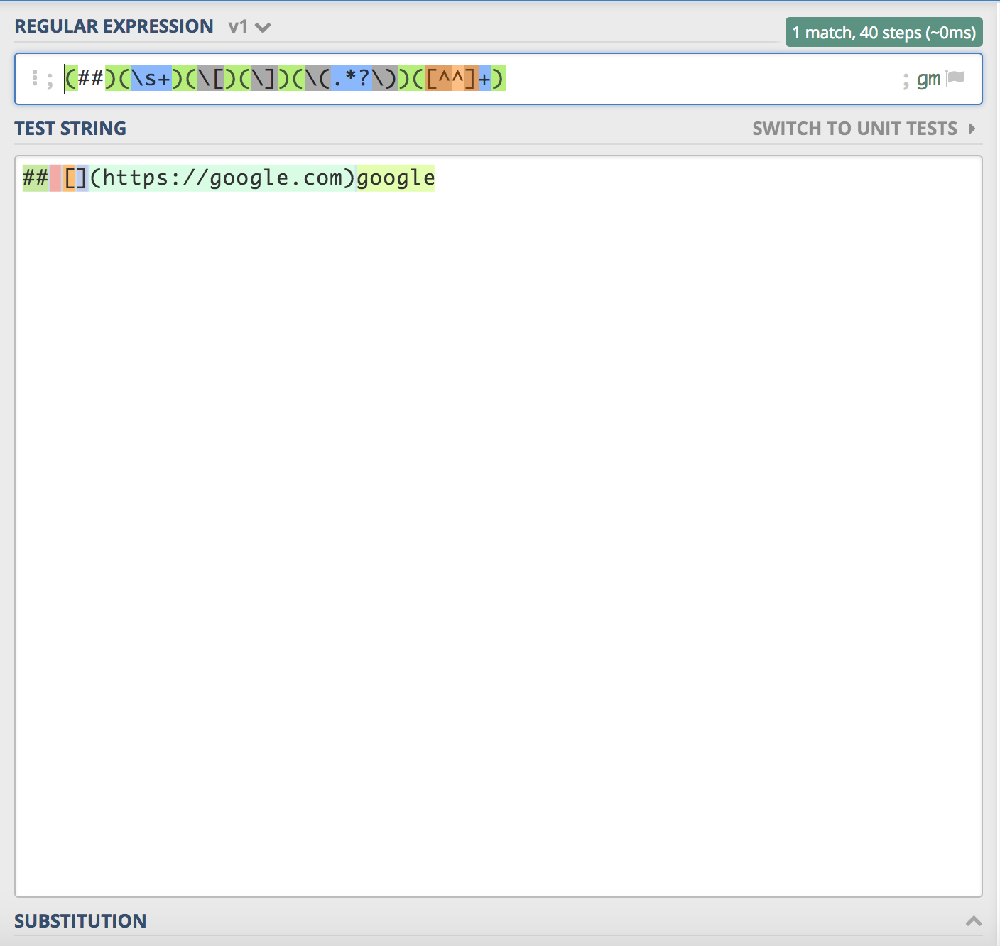
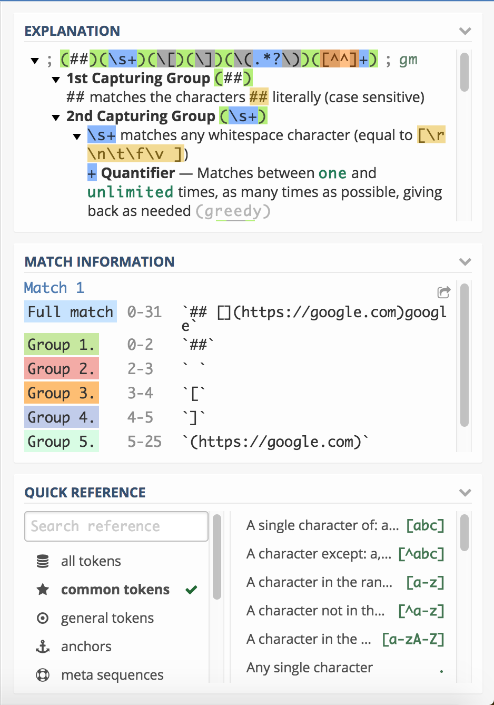
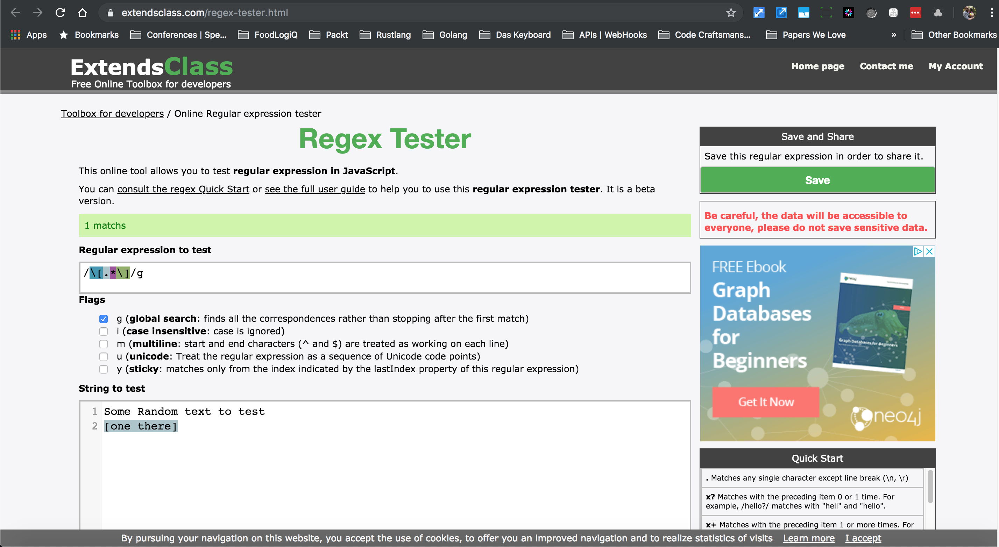
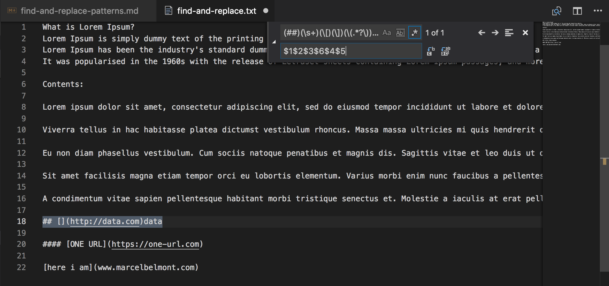
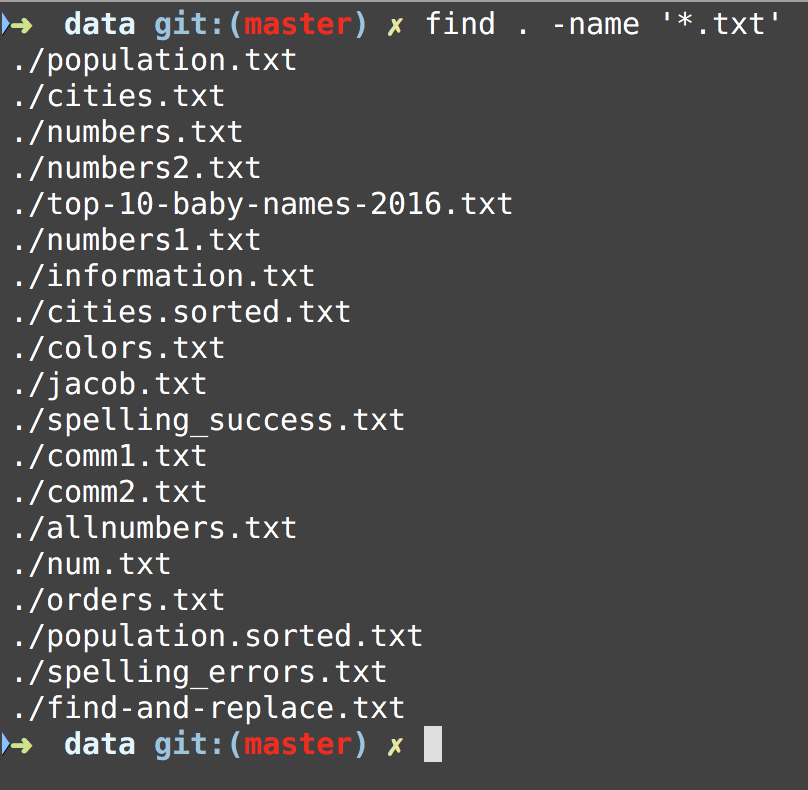
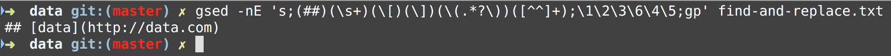

## Unix Programming and Regular Expressions Workshop - Find and Replace Patterns

## Sections:

* [Defining Regexes with online tool](#defining-regexes-with-online-tool)
* [Capture Groups](#capture-groups)
* [Backreferences for a regular expression](#backreferences-for-a-regular-expression)
* [Editor Example for Find and Replace](#editor-example-for-find-and-replace)
* [Using Find and Replace with the Shell](#using-find-and-replace-with-the-shell)
* [Advanced Find and Replace Patterns](#advanced-find-and-replace-patterns)
* [Bread Crumb Navigation](#bread-crumb-navigation)

#### Defining Regexes with online tool

There are a handful of ways to define a regex but we will cover some online tools that help write them.

You can try [Regexr](https://regexr.com/) or [Regex101](https://regex101.com/) to help write regexes and get helpful information about what is happening in the regular expression.



The first screenshot is the regex we are entering and the test string we are testing against.

**Regular Expression:**

```regex
(##)(\s+)(\[)(\])(\(.*?\))([^^]+)
```

**Test String:**

```
## [](https://google.com)google
```

The [Regex101](https://regex101.com/) online tool has a great feature of color coding each capture group for us and we can see each capture group in this example in the right side of the screen.



Here we have 6 Capture Groups:

1. 1st Capturing Group (##)
2. 2nd Capturing Group (\s+)
    1. \s+ matches any whitespace character (equal to [\r\n\t\f\v ])
3. 3rd Capturing Group (\[)
    1. \[ matches the character [ literally (case sensitive)
4. 4th Capturing Group (\])
    1. \] matches the character ] literally (case sensitive)
5. 5th Capturing Group (\(.*?\))
    1. \( matches the character ( literally (case sensitive)
    2. .*? matches any character (except for line terminators)
    3. *? Quantifier — Matches between zero and unlimited times, as few times as possible, expanding as needed (lazy)
    4. \) matches the character ) literally (case sensitive)
6. 6th Capturing Group ([^^]+)
    1. Match a single character not present in the list below [^^]+
    2. + Quantifier — Matches between one and unlimited times, as many times as possible, giving back as needed (greedy)
    3. ^ matches the character ^ literally (case sensitive)

##### Defining Regexes with extendsclass online tool

There is another tool that you can use to test and debug regexes.

[Extends Class Regex Tester](https://extendsclass.com/regex-tester.html)

Here is a screenshot of this tool in action:



###### Capture Groups

* Parentheses group the regex between them. 

* They capture the text matched by the regex inside them into a numbered group that can be reused with a numbered backreference. 

* They allow you to apply regex operators to the entire grouped regex. 
* This is what is meant by a capture group

###### Using Match Information for our Test String Example

Now that we know what a capture group is we can use this knowledge to break apart the different matching groups to use in a find and replace scenario

1. Group 1
    1. `##`
2. Group 2
    1. ` ` empty space here
3. Group 3
    1. `[`
4. Group 4
    1. `]`
5. Group 5
    1. `(https://google.com)`
6. Group 6
    1. `google`

#### Backreferences for a regular expression

back-references are regular expression commands which refer to a previous part of the matched regular expression. 

Back-references are specified with backslash and a single digit (e.g. `\1`). 

The part of the regular expression they refer to is called a subexpression, and is designated with parentheses.

Now that we have defined a backreference we can use them like this:

1. Backreference 1
    1. `\1`
    2. this matches `##`
2. Backreference 2
    1. `\2`
    2. this matches ` ` empty space
3. Backreference 3
    1. `\3`
    2. this matches `[`
4. Backreference 4
    1. `\4`
    2. this matches `]` 
5. Backreference 5
    1. `\5`
    2. this matches `(https://google.com)`
6. Backreference 6
    1. `\6`
    2. this matches `google`

#### Editor Example for Find and Replace

Now we can use this in order to do find and replace using the VSCode Editor like this:



In order to get the find menu open on a Mac just press `Command f` in your keyboard and then click the right arrow to expand to replace input box.

In visual studio code we use the `$` for backreferences like this `$1` instead of `\1`.

Notice that we did the following in this replace `$1$2$3$6$4$5` we swapped the contents of the match so that data in inserted into `[ ]` which is what we want for this.

#### Using Find and Replace with the Shell

By using the Unix Command Line we can take advantage of many more shell utilities to automate this task to many files.

Say that we wanted to apply this regex pattern with sed and with the find utility to find each Markdown file and create a backup we can do the following.

We have already introduced `find` in this workshop but we will introduce the `-exec` option with find here.



Notice that only markdown files were returned which is what we want.

Now we can use this in combination with the `-exec` option to apply an action to all of these files which will be a sed command to make a backup and write the change to the file like we want in place.



Notice this is the **sed** command:

```sed
gsed -nE 's;(##)(\s+)(\[)(\])(\(.*?\))([^^]+);\1\2\3\6\4\5;gp' find-and-replace.txt
```

Here I am using gnu sed instead of mac os x as gnu sed is more POSIX compliant and more useful and up to date version.

The option `-n` means only print captured lines and `-E` is for extended regular expressions.

Here we use `;` for delimiters instead of `/` which is the default to make it easier for the capture groups.

The final options of `gp` will globally apply to all occurrences and then print the captured group since we suppressed the default action of sed which is to print everything to standard output.

###### Bring Power of Find and Replace in Command Line

Now that we have verified what we want out of each command we can assemble the following command:

```bash
find . -name '*.txt' -exec gsed -Ei.bak 's;(##)(\s+)(\[)(\])(\(.*?\))([^^]+);\1\2\3\6\4\5;gp' '{}' \;
```

Note that we added `-exec` for the find action to take and then added `'{}'` and `\;`

Notice that the braces are enclosed in single quote marks to protect them from interpretation as shell script punctuation. 

The semicolon is similarly protected by the use of a backslash, though single quotes could have been used in that case also.

We also removed the `-n` option as it has an unintended consequence of removing the contents of the rest of the file.

We used it in the command line to see only what we captured but in the context of this command we want it to run for each command.

**It is important to note that we created a back up file with the `-i.bak` option just in case an issue occurred and to save us with a backup for problems with our command.**

#### Advanced Find and Replace Patterns

Typically with find and replace patterns you will want to do to check that *sed* is finding the pattern that you want to replace.

A trick with sed is to always write out all the delimiters before you start the find:

`sed 's///g'` and then go back and enter the text replacement

Let us say that we want to globally replace the following text *here is*

Now with *sed*: 

`sed 's/here is/there we go/g'`

We can place multiple commands by placing a `;` in between like this:

`sed 's/here is/there we go/g;s/to much/too little/g'`

You can virtually do as many commands in one sed expression as you want by doing this pattern.

*One thing to note is that you should experiment with sed on one file and then do this next step for global search and replace*

Now using find we can look for all the dat files and do a global find and replace like this:


`find . -name "*.dat" -exec sed -i .bak 's/here is/there we go/g;s/to much/too little/g' {} \;`

This command will look at current directory and every subdirectory and then execute the *sed* command(s) and do an edit and create a bak file that has the original text
we can look at the text that is changed with the *grep* command: 

```sh
> grep -nr "there we go" .
./data/otherText.dat:1:there we go the man
```

By doing this we can make sure that we get the text change like we expect and once we are confident we can delete the bak files like this

`find . -name "*.bak" -exec rm {} +`

Notice that with find and the `-exec` option we did this pattern `{} \;` and this pattern `{} +` this works as a placeholder for each file/folder

If you are doubly sure that your global find and replace works you can do this change to do an in place file edit with sed:

`find . -name "*.dat" -exec sed -i '' 's/here is/there we go/g;s/to much/too little/g' {} \;`

Notice here that we didn’t specify a file to backup with so sed just edits the file and doesn’t create any backup, the `''` is necessary on mac os x, in linux you can probably get away without doing it.

#### Bread Crumb Navigation
_________________________

Previous | Next
:------- | ---:
← [Shell Security](./shell-security.md) | [README](../README.md) →
