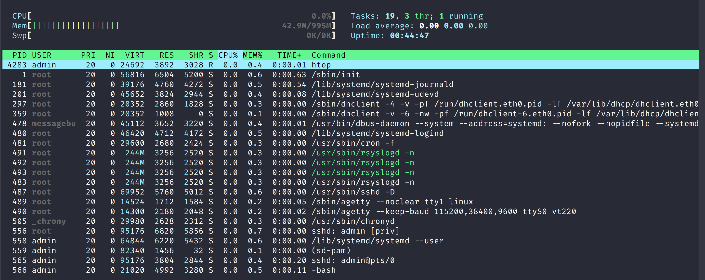

## Unix Programming and Regular Expressions Workshop - System Administration Commands

## Sections:

* [Memory Usage Commands](#memory-usage-commands)
    * [free command description](#free-command-description)
    * [free command options](#free-command-options)
    * [free command examples](#free-command-examples)
    * [Read /proc/meminfo stats](#proc-meminfo-stats)
    * [vmstat command description](#vmstat-command-description)
    * [vmstat command options](#vmstat-command-options)
    * [vmstat command examples](#vmstat-command-examples)
* [Process Information Commands](#process-information-commands)
    * [top|htop command description](#top\|htop-command-description)
    * [top|htop command options](#top\|htop-command-options)
    * [top|htop command examples](#top\|htop-command-examples)
    * [ps command description](#ps-command-description)
    * [ps command options](#ps-command-options)
    * [ps command examples](#ps-command-examples)
* [Environment Variable Commands](#environment-variable-commands)
    * [printenv command description](#printenv-command-description)
    * [printenv command options](#printenv-command-options)
    * [printenv command examples](#printenv-command-examples)
    * [env command description](#env-command-description)
    * [env command options](#env-command-options)
    * [env command examples](#env-command-examples)
* [Disk Usage Commands](#disk-usage-commands)
    * [df command description](#df-command-description)
    * [df command options](#df-command-options)
    * [df command examples](#df-command-examples)
    * [du command description](#du-command-description)
    * [du command options](#du-command-options)
    * [du command examples](#du-command-examples)
    * [stat command description](#stat-command-description)
    * [stat command options](#stat-command-options)
    * [stat command examples](#stat-command-examples)
    * [fdisk command description](#fdisk-command-description)
    * [fdisk command options](#fdisk-command-options)
    * [fdisk command examples](#fdisk-command-examples)
* [Network Commands](#network-commands)
    * [ifconfig command description](#ifconfig-command-description)
    * [ifconfig command options](#ifconfig-command-options)
    * [ifconfig command examples](#ifconfig-command-examples)
    * [traceroute command description](#traceroute-command-description)
    * [traceroute command options](#traceroute-command-options)
    * [traceroute command examples](#traceroute-command-examples)
    * [dig command description](#dig-command-description)
    * [dig command options](#dig-command-options)
    * [dig command examples](#dig-command-examples)
    * [telnet command description](#telnet-command-description)
    * [telnet command options](#telnet-command-options)
    * [telnet command examples](#telnet-command-examples)
* [FileSystem Commands](#filesystem-commands)
    * [mount|unmount command description](#mount\|unmount-command-description)
    * [mount|unmount command options](#mount\|unmount-command-options)
    * [mount|unmount command examples](#mount\|unmount-command-examples)
    * [fstab command description](#fstab-command-description)
    * [fstab file example](#fstab-file-example)
    * [tune2fs command description](#tune2fs-command-description)
    * [tune2fs command options](#tune2fs-command-options)
    * [tune2fs command examples](#tune2fs-command-examples)

* [Bread Crumb Navigation](#bread-crumb-navigation)

## Memory Usage Commands

There are several commands you can use in Unix/Linux for to check memory usage:

* free
* vmstats

**It is important to  check memory usage and memory used per process on a server that way resources do not fall short and users are able to access the server.**

For example a webserver must have enough memory to serve the traffic or else the website can become slow and in extreme traffic spike situations go down.

#### free command description

free - Display amount of free and used memory in the system

free  displays  the  total amount of free and used physical and swap memory in the system, as well as the buffers and caches used by the kernel. 

The information is gathered by parsing /proc/meminfo. 

The displayed columns are:

* total  
    * Total installed memory (MemTotal and SwapTotal in /proc/meminfo)

* used   
    * Used memory (calculated as total - free - buffers - cache)

* free   
    * Unused memory (MemFree and SwapFree in /proc/meminfo)

* shared 
    * Memory used (mostly) by tmpfs (Shmem in /proc/meminfo)

* buffers
    * Memory used by kernel buffers (Buffers in /proc/meminfo)

* cache  
    * Memory used by the page cache and slabs (Cached and SReclaimable in /proc/meminfo)

* buff/cache
    * Sum of buffers and cache

* available
    * Estimation of how much memory is available for starting new applications, without swapping.

#### free command options

List of `free` command options:

* `-b`, `--bytes`
    * Display the amount of memory in bytes.

* `-k`, `--kibi`
    * Display the amount of memory in kibibytes.  This is the default.

* `-m`, `--mebi`
    * Display the amount of memory in mebibytes.

* `-g`, `--gibi`
    * Display the amount of memory in gibibytes.

**Read the Fine Manual** for more options
at [Free Man Page](http://man7.org/linux/man-pages/man1/free.1.html)

#### free command examples

```bash
> free -m
              total        used        free      shared  buff/cache   available
Mem:            994          38         866           3          90         839
Swap:             0           0           0
```

Here we display the amount of memory used in mebibytes.

#### proc meminfo stats

We can also view the contents of the `/proc/meminfo` file which has dynamic information about the Unix/Linux Kernel and of the system.

You can cat the contents of the file or you can use grep like this:

```bash
> grep -E "Mem*|Buffers|Cached|Swap*" /proc/meminfo
MemTotal:        1018452 kB
MemFree:          886536 kB
MemAvailable:     859580 kB
Buffers:           12276 kB
Cached:            67408 kB
SwapCached:            0 kB
SwapTotal:             0 kB
SwapFree:              0 kB
```

*Here we use extended regular expression mode in grep `-E` to utilize alternation to view some statistics related to memory usage.*

#### vmstat command description

`vmstat` - Report virtual memory statistics

`vmstat` reports information about processes, memory, paging, block IO, traps, disks and cpu activity.

The first report produced gives averages since the last reboot.  

Additional reports give information on a sampling period of length delay.  
The process and memory reports are instantaneous in either case.

#### vmstat command options

List of `vmstat` command options:

* `-a`, `--active`
    * Display active and  inactive memory, given a 2.5.41 kernel or better.

* `-f`, `--forks`
    * The -f switch displays the number of forks since boot.  
    * This includes the fork, vfork, and clone system calls, and is equivalent to the total number of tasks created.  
    * Each process is represented by one or more  tasks,  depending  on  thread  usage.

* `-m`, `--slabs`
    * Displays slabinfo.

* `-n`, `--one-header`
    * Display the header only once rather than periodically.

* `-s`, `--stats`
    * Displays a table of various event counters and memory statistics.  This display does not repeat.

* `-d`, `--disk`
    * Report disk statistics (2.5.70 or above required).

* `-D`, `--disk-sum`
    * Report some summary statistics about disk activity.

**Read the Fine Manual** for more options
at [vmstat man page](http://man7.org/linux/man-pages/man8/vmstat.8.html)

#### vmstat command examples

```bash
> vmstat -s
      1018452 K total memory
        39028 K used memory
        64168 K active memory
        28412 K inactive memory
       886280 K free memory
        12376 K buffer memory
        80768 K swap cache
            0 K total swap
            0 K used swap
            0 K free swap
          374 non-nice user cpu ticks
            0 nice user cpu ticks
          163 system cpu ticks
       152579 idle cpu ticks
           79 IO-wait cpu ticks
            0 IRQ cpu ticks
            2 softirq cpu ticks
          758 stolen cpu ticks
        74489 pages paged in
        10328 pages paged out
            0 pages swapped in
            0 pages swapped out
        19377 interrupts
        34163 CPU context switches
   1566773958 boot time
          695 forks
```

The command above displays a table of various event counters and memory statistics on this server.

## Process Information Commands

In Unix/Linux systems there are a number of commands for displaying running processes, and to manage/change priority/kill processes.

#### top|htop command description

top - display Linux processes

The  top program provides a dynamic real-time view of a running system.  

It can display system summary information as well as a list of processes or threads currently being managed by the Linux kernel.  The types of system summary information shown and  the  types, order and size of information displayed for processes are all user configurable and that configuration can be made persistent across restarts.

###### Installing htop on Debian Linux

```bash
sudo su -
apt install htop
```

###### htop command

htop - interactive process viewer

htop is similar to top, but allows you to scroll vertically and horizontally, so you can see all the processes running on the system, along with their full command lines, as well as viewing them as a process tree, selecting multiple processes and acting on them all at once.

#### top|htop command options

List of `top` command options:

* `-h` | `-v`  
    * `:Help/Version`
        * Show library version and the usage prompt, then quit.

* `-b`  `:Batch-mode` operation
    * Starts top in Batch mode, which could be useful for sending output from top to other programs or to a file.  
    * In this mode, top will not accept input and runs until the iterations limit you've set with the `-n` command-line option or until killed.

* `-c`  `:Command-line/Program-name` toggle
    Starts  top  with  the last remembered `-c` state reversed.  Thus, if top was displaying command lines, now that field will show
    program names, and vice versa.

**Read the Fine Manual** for more options
at [vmstat man page](http://man7.org/linux/man-pages/man8/vmstat.8.html)

###### htop command options

List of `htop` command options:

* `-d` `--delay=DELAY`
    * Delay between updates, in tenths of seconds

* `-C` `--no-color` `--no-colour`
    * Start htop in monochrome mode

* `-h` `--help`
    * Display a help message and exit

* `-p` `--pid=PID,PID...`
    * Show only the given PIDs

* `-s` `--sort-key COLUMN`
    * Sort by this column (use --sort-key help for a column list)

* `-u` `--user=USERNAME`
    * Show only the processes of a given user

* `-v` `--version`
    * Output version information and exit

#### top|htop command examples


Here you can see top command statistics

###### htop command example



*Notice that in this screenshot `htop` has colored output as well as additional information.*

#### ps command description

ps - report a snapshot of the current processes.

ps displays information about a selection of the active processes.  

If you want a repetitive update of the selection and the displayed information, use top instead.

#### ps command options

List of `ps` command options:

* `-C` cmdlist
    * Select by command name.  
    * This selects the processes whose executable name is given in cmdlist.

* `-G` grplist
    * Select by real group ID (RGID) or name.  
    * This selects the processes whose real group name or ID is in the grplist list.  
    * The real group ID identifies the group of the user who created the process, see getgid.

* `-g` `grplist`
    * Select by session OR by effective group name.  
    * Selection by session is specified by many standards, but selection by effective group is the logical behavior that several other operating systems use.  
    * This ps will select by session when the list is completely numeric (as sessions are).  
    * Group ID numbers will work only when some group names are also specified.

**Read the Fine Manual** for more options
at [vmstat man page](http://man7.org/linux/man-pages/man1/ps.1.html)

#### ps command examples

###### To see every process on the system using standard syntax:

* `ps -e`
* `ps -ef`
* `ps -eF`
* `ps -ely`

```bash
> ps -ef
UID        PID  PPID  C STIME TTY          TIME CMD
root         1     0  0 22:59 ?        00:00:00 /sbin/init
root         2     0  0 22:59 ?        00:00:00 [kthreadd]
root         3     2  0 22:59 ?        00:00:00 [ksoftirqd/0]
root         5     2  0 22:59 ?        00:00:00 [kworker/0:0H]
root         6     2  0 22:59 ?        00:00:00 [kworker/u30:0]
root         7     2  0 22:59 ?        00:00:00 [rcu_sched]
root         8     2  0 22:59 ?        00:00:00 [rcu_bh]
root         9     2  0 22:59 ?        00:00:00 [migration/0]
root        10     2  0 22:59 ?        00:00:00 [lru-add-drain]
root        11     2  0 22:59 ?        00:00:00 [watchdog/0]
root        12     2  0 22:59 ?        00:00:00 [cpuhp/0]
```

You can grep for a certain process like this for example:

```bash
ps -ef | grep mongod
```

###### To see every process on the system using BSD syntax:

* `ps ax`
* `ps axu`

###### To print a process tree:

* `ps -ejH`
* `ps axjf`

```bash
> ps -ejH
  PID  PGID   SID TTY          TIME CMD
    2     0     0 ?        00:00:00 kthreadd
    3     0     0 ?        00:00:00   ksoftirqd/0
    5     0     0 ?        00:00:00   kworker/0:0H
    6     0     0 ?        00:00:00   kworker/u30:0
    7     0     0 ?        00:00:00   rcu_sched
    8     0     0 ?        00:00:00   rcu_bh
    9     0     0 ?        00:00:00   migration/0
   10     0     0 ?        00:00:00   lru-add-drain
.........................................................   
```

###### To get info about threads:
          
* `ps -eLf`
* `ps axms`

```bash
> ps -eLf
UID        PID  PPID   LWP  C NLWP STIME TTY          TIME CMD
root         1     0     1  0    1 Aug25 ?        00:00:00 /sbin/init
root         2     0     2  0    1 Aug25 ?        00:00:00 [kthreadd]
root         3     2     3  0    1 Aug25 ?        00:00:00 [ksoftirqd/0]
root         5     2     5  0    1 Aug25 ?        00:00:00 [kworker/0:0H]
root         6     2     6  0    1 Aug25 ?        00:00:00 [kworker/u30:0]
root         7     2     7  0    1 Aug25 ?        00:00:00 [rcu_sched]
root         8     2     8  0    1 Aug25 ?        00:00:00 [rcu_bh]
.........................................................  
```

###### To get security info:
          
* `ps -eo euser,ruser,suser,fuser,f,comm,label`
* `ps axZ`
* `ps -eM`

```bash
ps -eM
LABEL                             PID TTY          TIME CMD
-                                   1 ?        00:00:00 systemd
-                                   2 ?        00:00:00 kthreadd
-                                   3 ?        00:00:00 ksoftirqd/0
-                                   5 ?        00:00:00 kworker/0:0H
-                                   6 ?        00:00:00 kworker/u30:0
-                                   7 ?        00:00:00 rcu_sched
.........................................................  
```

## Environment Variable Commands


Environmental variables are variables that are defined for the current shell and are inherited by any child shells or processes. 

These environment variables are then passed to processes that are spawned by a shell session.

#### printenv command description

printenv - print all or part of environment

Print the values of the specified environment VARIABLE(s).  If no VARIABLE is specified, print name and value pairs for them all.

#### printenv command options

List of `printenv` command options:

* `-0`, `--null`
 * end each output line with NUL, not newline

* `--help` 
    * display this help and exit

* `--version`
    * output version information and exit

**Read the Fine Manual** for more options
at [printenv man page](http://man7.org/linux/man-pages/man1/printenv.1.html)

#### printenv command examples

```bash
> printenv
LS_COLORS=rs=0:di=01;34:ln=01;36:mh=00:pi=40;33:so=01;35:do=01;35:bd=40;33;01:cd=40;33;01:or=40;31;01:mi=00:su=37;41:sg=30;43:ca=30;41:tw=30;42:ow=34;42:st=37;44:ex=01;32:*.tar=01;31:*.tgz=01;31:*.arc=01;31:*.arj=01;31:*.taz=01;31:*.lha=01;31:*.lz4=01;31:*.lzh=01;31:*.lzma=01;31:*.tlz=01;31:*.txz=01;31:*.tzo=01;31:*.t7z=01;31:*.zip=01;31:*.z=01;31:*.Z=01;31:*.dz=01;31:*.gz=01;31:*.lrz=01;31:*.lz=01;31:*.lzo=01;31:*.xz=01;31:*.zst=01;31:*.tzst=01;31:*.bz2=01;31:*.bz=01;31:*.tbz=01;31:*.tbz2=01;31:*.tz=01;31:*.deb=01;31:*.rpm=01;31:*.jar=01;31:*.war=01;31:*.ear=01;31:*.sar=01;31:*.rar=01;31:*.alz=01;31:*.ace=01;31:*.zoo=01;31:*.cpio=01;31:*.7z=01;31:*.rz=01;31:*.cab=01;31:*.jpg=01;35:*.jpeg=01;35:*.mjpg=01;35:*.mjpeg=01;35:*.gif=01;35:*.bmp=01;35:*.pbm=01;35:*.pgm=01;35:*.ppm=01;35:*.tga=01;35:*.xbm=01;35:*.xpm=01;35:*.tif=01;35:*.tiff=01;35:*.png=01;35:*.svg=01;35:*.svgz=01;35:*.mng=01;35:*.pcx=01;35:*.mov=01;35:*.mpg=01;35:*.mpeg=01;35:*.m2v=01;35:*.mkv=01;35:*.webm=01;35:*.ogm=01;35:*.mp4=01;35:*.m4v=01;35:*.mp4v=01;35:*.vob=01;35:*.qt=01;35:*.nuv=01;35:*.wmv=01;35:*.asf=01;35:*.rm=01;35:*.rmvb=01;35:*.flc=01;35:*.avi=01;35:*.fli=01;35:*.flv=01;35:*.gl=01;35:*.dl=01;35:*.xcf=01;35:*.xwd=01;35:*.yuv=01;35:*.cgm=01;35:*.emf=01;35:*.ogv=01;35:*.ogx=01;35:*.aac=00;36:*.au=00;36:*.flac=00;36:*.m4a=00;36:*.mid=00;36:*.midi=00;36:*.mka=00;36:*.mp3=00;36:*.mpc=00;36:*.ogg=00;36:*.ra=00;36:*.wav=00;36:*.oga=00;36:*.opus=00;36:*.spx=00;36:*.xspf=00;36:
.......
LANG=en_US.UTF-8
....
```

In the command above we merely print out every environment variable

```bash
> printenv PATH
/usr/local/bin:/usr/bin:/bin:/usr/local/games:/usr/game
```

#### env command description

env - run a program in a modified environment

Set each NAME to VALUE in the environment and run COMMAND.

#### env command options

List of `env` command options:

-i, --ignore-environment
              start with an empty environment

       -0, --null
              end each output line with NUL, not newline

       -u, --unset=NAME
              remove variable from the environment

       --help display this help and exit

       --version
              output version information and exit

#### env command examples

```bash
env | grep USER
USER=admin
```

Notice that in the command above we used `env` command to find the value of USER environment variable.

We can also use `env` to set environment variables like so:

```bash
> env DUDE=john
....................................................
DUDE=john
```

This will only set the environment for the duration of the command as the next example proves:

```bash
env | grep DUDE
# Nothing shown
```

The next example shows using `env` by passing variable and then calling command

```bash
env VAR=val1 VAR2=val2 <unix_command> <arguments>
```

Although this example is generic, it illustrates using env to set environment variables that will be set when command is run.

## Disk Usage Commands

There are various commands to check disk usage including:

* df
* du
* stat
* fdisk

#### df command description

`df` - report file system disk space usage

`df` displays the amount of disk space available on the file system containing each file name argument.  

If no file name is given, the space available on all currently mounted  file  systems  is  shown.   

Disk space is shown in 1K blocks by default, unless the environment variable `POSIXLY_CORRECT` is set, in which case 512-byte blocks are used.

#### df command options

List of `df` command options:

* `-a`, `--all`
    * include pseudo, duplicate, inaccessible file systems

* `-B`, `--block-size=SIZE`
    * scale sizes by SIZE before printing them; e.g., '-BM' prints sizes in units of 1,048,576 bytes; see SIZE format below

* `-h`, `--human-readable`
    * print sizes in powers of 1024 (e.g., 1023M)

* `-H`, `--si`
    * print sizes in powers of 1000 (e.g., 1.1G)

* `-i`, `--inodes`
    * list inode information instead of block usage

* `-k`     
    * like `--block-size=1K`

* `-l`, `--local`
    * limit listing to local file systems

* `--no-sync`
    * do not invoke sync before getting usage info (default)

**Read the Fine Manual** for more options
at [df man page](http://man7.org/linux/man-pages/man1/df.1.html)

#### df command examples

```bash
## get current directory size
> df -h
Filesystem      Size  Used Avail Use% Mounted on
udev            487M     0  487M   0% /dev
tmpfs           100M   12M   89M  12% /run
/dev/xvda1      7.9G  1.1G  6.4G  15% /
tmpfs           498M     0  498M   0% /dev/shm
tmpfs           5.0M     0  5.0M   0% /run/lock
tmpfs           498M     0  498M   0% /sys/fs/cgroup
tmpfs           100M     0  100M   0% /run/user/1000

## display information on particular partition
df -hT /etc
Filesystem     Type  Size  Used Avail Use% Mounted on
/dev/xvda1     ext4  7.9G  1.1G  6.4G  15% /
```

#### du command description

`du` - estimate file space usage

Summarize disk usage of the set of FILEs, recursively for directories.

#### du command options

List of `du` command options:

* `-0`, `--null`
    * end each output line with NUL, not newline

* `-a`, `--all`
    * write counts for all files, not just directories

* `--apparent-size`
    * print apparent sizes, rather than disk usage; although the apparent size is usually smaller, it may be larger due to holes in ('sparse') files, internal fragmentation, indirect blocks, and the like

* `-B`, `--block-size=SIZE`
    * scale sizes by SIZE before printing them; e.g., '-BM' prints sizes in units of 1,048,576 bytes; see SIZE format below

* `-b`, `--bytes`
    * equivalent to '--apparent-size `--block-size=1'`

* `-c`, `--total`
    * produce a grand total

* `-D`, `--dereference-args`
    * dereference only symlinks that are listed on the command line

**Read the Fine Manual** for more options
at [du man page](http://man7.org/linux/man-pages/man1/du.1.html)

#### du command examples

```bash
## default disk usage information example
> du 
8	./.config/htop
12	./.config
8	./.ssh
44	.

# the `-h` option lets you display output in Byte, Kilobyte, Megabyte, Gigabyte, Terabyte and Petabyte (Human-readable output)
> du -h /var/log
8.0K	/var/log/unattended-upgrades
152K	/var/log/fai/fai-debian-image/install-20190813_161832
156K	/var/log/fai/fai-debian-image
160K	/var/log/fai
92K	/var/log/apt
4.0K	/var/log/chrony
1.5M	/var/log

# -x: skip directories on different file systems
# -c: produce a grand total
# -h: print sizes in human readable format (e.g., 1K 234M 2G)
du -xch --max-depth=1 /
4.0K	/lib64
4.0K	/mnt
32K	/tmp
4.0K	/srv
16K	/lost+found
579M	/usr
48K	/home
4.0K	/opt
6.1M	/sbin
7.4M	/bin
3.3M	/etc
24K	/root
176M	/var
4.0K	/media
225M	/lib
34M	/boot
1.1G	/
1.1G	total
```

#### stat command description

`stat` - display file or file system status

Display file or file system status.

#### stat command options

List of `stat` command options:

* `-L`, `--dereference`
    * follow links

* `-f`, `--file-system`
    * display file system status instead of file status

* `-c`  `--format=FORMAT`
    * use the specified FORMAT instead of the default; output a newline after each use of FORMAT

* `--printf=FORMAT`
    * like  `--format`,  but  interpret  backslash  escapes,  and  do not output a mandatory trailing newline; if you want a newline, include \n in FORMAT

* `-t`, `--terse`
    * print the information in terse form

* `--help`
    *  display this help and exit

**Read the Fine Manual** for more options
at [stat man page](http://man7.org/linux/man-pages/man2/stat.2.html)

#### stat command examples

```bash
# Check Linux File Status
stat /var/log/syslog
  File: /var/log/syslog
  Size: 13699     	Blocks: 32         IO Block: 4096   regular file
Device: ca01h/51713d	Inode: 406955      Links: 1
Access: (0640/-rw-r-----)  Uid: (    0/    root)   Gid: (    4/     adm)
Access: 2019-08-28 06:25:01.090542366 +0000
Modify: 2019-08-28 09:54:22.127128119 +0000
Change: 2019-08-28 09:54:22.127128119 +0000
 Birth: -

# Check File System Status
stat -f /var/log/syslog
  File: "/var/log/syslog"
    ID: 35574f912c967e5a Namelen: 255     Type: ext2/ext3
Block size: 4096       Fundamental block size: 4096
Blocks: Total: 2047598    Free: 1774850    Available: 1665910
Inodes: Total: 524288     Free: 483503

# Enable Following of Symbolic Links
stat -L /bin/
  File: /bin/
  Size: 4096      	Blocks: 8          IO Block: 4096   directory
Device: ca01h/51713d	Inode: 262183      Links: 2
Access: (0755/drwxr-xr-x)  Uid: (    0/    root)   Gid: (    0/    root)
Access: 2019-08-28 09:44:08.931003908 +0000
Modify: 2019-08-13 16:21:21.317589334 +0000
Change: 2019-08-13 16:21:21.317589334 +0000
 Birth: -

# Use a Custom Format To Display Information
stat --printf='%U\n%G\n%C\n%z\n' /var/log
root
root
stat: failed to get security context of '/var/log': No data available
?
2019-08-28 06:25:01.090542366 +0000
```

#### fdisk command description

fdisk - manipulate disk partition table

fdisk  is a dialog-driven program for creation and manipulation of partition tables.  
It understands GPT, MBR, Sun, SGI and BSD partition tables.

Block devices can be divided into one or more logical disks called partitions.  This division is recorded in  the  partition  table,
usually found in sector 0 of the disk.  (In the BSD world one talks about `disk slices' and a `disklabel'.)

All  partitioning is driven by device I/O limits (the topology) by default.  fdisk is able to optimize the disk layout for a 4K-sec‐
tor size and use an alignment offset on modern devices for MBR and GPT.  It is always a good idea to follow fdisk's defaults as  the
default  values  (e.g.  first  and last partition sectors) and partition sizes specified by the &gt;size&lt;{M,G,...} notation are always
aligned according to the device properties.

#### fdisk command options

List of `fdisk` command options:

* `-b`, `--sector-size sectorsize`
    * Specify the sector size of the disk.  Valid values are 512, 1024, 2048, and 4096.  (Recent kernels know the sector size.  
    * Use this option only on old kernels or to override the kernel's ideas.)  
    * Since util-linux-2.17, fdisk differentiates between logical and physical sector size.  
    * This option changes both sector sizes to sectorsize.

* `-B`, `--protect-boot`
    * Don't erase the begin of the first disk sector when create a new disk label.  
    * This feature is supported for GPT and MBR.

* `-c`, `--compatibility[=mode]`
    * Specify  the compatibility mode, 'dos' or 'nondos'.  The default is non-DOS mode. 

* `-h`, `--help`
    * Display a help text and exit.

* `-L`, `--color[=when]`
    * Colorize  the output.  The optional argument when can be auto, never or always.  
    * If the when argument is omitted, it defaults to auto.  The colors can be disabled; for the current built-in default see the --help output. 

**Read the Fine Manual** for more options
at [fdisk man page](http://man7.org/linux/man-pages/man8/fdisk.8.html)

#### fdisk command examples

###### View all Disk Partitions in Linux

```bash
> sudo su -
> fdisk -l
Disk /dev/xvda: 8 GiB, 8589934592 bytes, 16777216 sectors
Units: sectors of 1 * 512 = 512 bytes
Sector size (logical/physical): 512 bytes / 512 bytes
I/O size (minimum/optimal): 512 bytes / 512 bytes
Disklabel type: dos
Disk identifier: 0x242113bb

Device     Boot Start      End  Sectors Size Id Type
/dev/xvda1 *     2048 16777215 16775168   8G 83 Linux
```

###### View Specific Disk Partition in Linux

```bash
fdisk -l /dev/xvda
Disk /dev/xvda: 8 GiB, 8589934592 bytes, 16777216 sectors
Units: sectors of 1 * 512 = 512 bytes
Sector size (logical/physical): 512 bytes / 512 bytes
I/O size (minimum/optimal): 512 bytes / 512 bytes
Disklabel type: dos
Disk identifier: 0x242113bb

Device     Boot Start      End  Sectors Size Id Type
/dev/xvda1 *     2048 16777215 16775168   8G 83 Linux
```

###### Check all Available fdisk Commands

```bash
fdisk /dev/xvda

Welcome to fdisk (util-linux 2.29.2).
Changes will remain in memory only, until you decide to write them.
Be careful before using the write command.


Command (m for help): m

Help:

  DOS (MBR)
   a   toggle a bootable flag
   b   edit nested BSD disklabel
   c   toggle the dos compatibility flag

  Generic
   d   delete a partition
   F   list free unpartitioned space
   l   list known partition types
   n   add a new partition
   p   print the partition table
   t   change a partition type
   v   verify the partition table
   i   print information about a partition

  Misc
   m   print this menu
   u   change display/entry units
   x   extra functionality (experts only)

  Script
   I   load disk layout from sfdisk script file
   O   dump disk layout to sfdisk script file

  Save & Exit
   w   write table to disk and exit
   q   quit without saving changes

  Create a new label
   g   create a new empty GPT partition table
   G   create a new empty SGI (IRIX) partition table
   o   create a new empty DOS partition table
   s   create a new empty Sun partition table
```

## Network Commands

> Network computer devices that originate, route and terminate the data are called network nodes.[1] Nodes are generally identified by network addresses, and can include hosts such as personal computers, phones, and servers, as well as networking hardware such as routers and switches. Two such devices can be said to be networked together when one device is able to exchange information with the other device, whether or not they have a direct connection to each other. In most cases, application-specific communications protocols are layered (i.e. carried as payload) over other more general communications protocols. This formidable collection of information technology requires skilled network management to keep it all running reliably.

#### ifconfig command description

ifconfig - configure a network interface

Ifconfig  is used to configure the kernel-resident network interfaces.  It is used at boot time to set up interfaces as necessary.

After that, it is usually only needed when debugging or when system tuning is needed.

#### ifconfig command options

List of `ifconfig` options:

* `-a` display all interfaces which are currently available, even if down

* `-s` display a short list (like netstat -i)

* `-v` be more verbose for some error conditions

* `interface`
    * The  name of the interface.  This is usually a driver name followed by a unit number, for example eth0 for the first Ethernet interface. 

* `up` *This flag causes the interface to be activated. 

**Read the Fine Manual** for more options
at [ifconfig man page](https://manpages.debian.org/stretch/net-tools/ifconfig.8.en.html)

#### ifconfig command examples

###### display all interfaces which are currently available, even if down

`ifconfig -a `

###### display information on a particular interface (eth0) in this example

`ifconfig eth0`

#### traceroute command description

`traceroute` - print the route packets trace to network host

`traceroute`  tracks  the route packets taken from an IP network on their way to a given host. It utilizes the IP protocol's time to live (TTL) field and attempts to elicit an ICMP TIME_EXCEEDED response from each gateway along the path to the host.

#### traceroute command options

List of `traceroute` options:

* `--help` Print help info and exit.

* `-4`, `-6` Explicitly force IPv4 or IPv6 tracerouting. 
    * By default, the program will try to resolve the  name  given,  and  choose  the appropriate  protocol  automatically.  If  resolving  a host name returns both IPv4 and IPv6 addresses traceroute will use IPv4.

* `-I`, `--icmp`
    * Use ICMP ECHO for probes

* `-T`, `--tcp`
    * Use TCP SYN for probes

* `-d`, `--debug`
    * Enable socket level debugging (when the Linux kernel supports it)

* `-F`, `--dont-fragment`
    * Do not fragment probe packets. 

**Read the Fine Manual** for more options
at [traceroute man page](https://linux.die.net/man/8/traceroute)

#### traceroute command examples

###### Run traceroute on google.com

```bash
> traceroute google.com
traceroute to google.com (172.217.15.110), 30 hops max, 60 byte packets
 1  216.182.229.240 (216.182.229.240)  2.909 ms 216.182.226.64 (216.182.226.64)  11.100 ms 216.182.226.228 (216.182.226.228)  13.826 ms
 2  100.66.13.148 (100.66.13.148)  19.540 ms 100.66.12.128 (100.66.12.128)  33.635 ms 100.66.13.124 (100.66.13.124)  21.646 ms
 3  100.66.15.70 (100.66.15.70)  12.782 ms 100.66.11.114 (100.66.11.114)  11.947 ms 100.66.10.228 (100.66.10.228)  18.313 ms
 4  100.66.7.39 (100.66.7.39)  10.372 ms 100.66.7.29 (100.66.7.29)  12.425 ms 100.66.6.155 (100.66.6.155)  17.452 ms
 5  100.66.5.231 (100.66.5.231)  20.238 ms 100.66.5.43 (100.66.5.43)  60.356 ms 100.66.5.205 (100.66.5.205)  18.193 ms
 6  100.65.13.193 (100.65.13.193)  0.531 ms  0.276 ms 100.65.12.97 (100.65.12.97)  0.376 ms
 7  52.93.29.3 (52.93.29.3)  0.329 ms 52.93.28.199 (52.93.28.199)  0.503 ms 52.93.29.3 (52.93.29.3)  0.617 ms
 8  100.100.30.52 (100.100.30.52)  0.541 ms 100.100.30.54 (100.100.30.54)  0.498 ms 100.100.28.62 (100.100.28.62)  0.563 ms
 9  100.95.7.161 (100.95.7.161)  21.276 ms 100.95.7.112 (100.95.7.112)  0.829 ms 100.95.7.161 (100.95.7.161)  19.871 ms
10  100.100.30.112 (100.100.30.112)  0.517 ms 100.100.30.68 (100.100.30.68)  1.015 ms 52.93.114.40 (52.93.114.40)  8.742 ms
11  100.95.7.177 (100.95.7.177)  0.839 ms 100.95.7.241 (100.95.7.241)  1.191 ms 52.93.27.140 (52.93.27.140)  0.645 ms
12  52.93.114.114 (52.93.114.114)  14.170 ms 52.93.114.30 (52.93.114.30)  13.165 ms 52.93.114.42 (52.93.114.42)  6.670 ms
13  * 52.93.27.136 (52.93.27.136)  0.607 ms 108.170.246.1 (108.170.246.1)  0.675 ms
14  216.239.54.106 (216.239.54.106)  0.758 ms 52.95.219.141 (52.95.219.141)  0.968 ms  0.939 ms
15  iad30s21-in-f14.1e100.net (172.217.15.110)  0.615 ms * *
```

#### dig command description

`dig` - DNS lookup utility

`dig` (domain information groper) is a flexible tool for interrogating DNS name servers. 

It performs DNS lookups and displays the answers that are returned from the name server(s) that were queried. 

Most DNS administrators use dig to troubleshoot DNS problems because of its flexibility, ease of use and clarity of output. Other lookup tools tend to have less functionality than dig.

###### Install dig with dnsutils

`sudo apt install dnsutils`

#### dig command options

List of `dig` command options:

* `-4`
    * Use IPv4 only.

* `-6`
    * Use IPv6 only.

* `-b` address[#port]
    * Set the source IP address of the query. The address must be a valid address on one of the host's network interfaces.

* `-c class`
    * Set the query class. The default class is IN; other classes are HS for Hesiod records or CH for Chaosnet records.

* `-f file`
    * Batch mode: dig reads a list of lookup requests to process from the given file. Each line in the file should be organized in
    the same way they would be presented as queries to dig using the command-line interface.

* `-i`
    * Do reverse IPv6 lookups using the obsolete RFC1886 IP6.INT domain, which is no longer in use. Obsolete bit string label queries (RFC2874) are not attempted.

* `-k keyfile`
    * Sign queries using TSIG using a key read from the given file. Key files can be generated using tsig-keygen(8). When using TSIG authentication with dig, the name server that is queried needs to know the key and algorithm that is being used. In BIND, this
    is done by providing appropriate key and server statements in named.conf.

**Read the Fine Manual** for more options
at [dig man page](https://manpages.debian.org/jessie/dnsutils/dig.1.en.html)

#### dig command examples

###### Running dnslookup for twitter.com

```bash
dig twitter.com

; <<>> DiG 9.10.3-P4-Debian <<>> twitter.com
;; global options: +cmd
;; Got answer:
;; ->>HEADER<<- opcode: QUERY, status: NOERROR, id: 49918
;; flags: qr rd ra; QUERY: 1, ANSWER: 2, AUTHORITY: 0, ADDITIONAL: 1

;; OPT PSEUDOSECTION:
; EDNS: version: 0, flags:; udp: 4096
;; QUESTION SECTION:
;twitter.com.			IN	A

;; ANSWER SECTION:
twitter.com.		60	IN	A	104.244.42.65
twitter.com.		60	IN	A	104.244.42.1

;; Query time: 1 msec
;; SERVER: 172.31.0.2#53(172.31.0.2)
;; WHEN: Tue Sep 10 14:24:42 UTC 2019
;; MSG SIZE  rcvd: 72
```

###### Find the TTL for my personal website

```bash
dig +nocmd marcelbelmont.com +noall +answer
marcelbelmont.com.	60	IN	A	104.28.24.116
marcelbelmont.com.	60	IN	A	104.28.25.116
```

###### To find the DNS Records for my personal website

```bash
> dig marcelbelmont.com NS +noall +answer

; <<>> DiG 9.10.3-P4-Debian <<>> marcelbelmont.com NS +noall +answer
;; global options: +cmd
marcelbelmont.com.	60	IN	NS	marek.ns.cloudflare.com.
marcelbelmont.com.	60	IN	NS	adi.ns.cloudflare.com.
```

###### To find the configured full TTL value you need to query one of the DNS servers obtained by the command above.

```bash
> dig +noauthority +noquestion +nostats marcelbelmont.com @marek.ns.cloudflare.com
```

#### telnet command description

telnet connect destination host:port via a telnet protocol if connection establishes means connectivity between two hosts is working fine.

`telnet` — user interface to the TELNET protocol

The telnet command is used for interactive communication with another host using the TELNET protocol. It begins in command mode, where it prints a telnet prompt ("telnet> "). If telnet is invoked with a host argument, it performs an open command implicitly.

#### telnet command options

List of `telnet` options:

* `-4` Force IPv4 address resolution.

* `-6` Force IPv6 address resolution.

* `-8` Request 8-bit operation. This causes an attempt to negotiate the TELNET BINARY option for both input and output.

* `-E` Disables the escape character functionality; that is, sets the escape character to no character.

* `-L` Specifies an 8-bit data path on output.  This causes the TELNET BINARY option to be negotiated on just output.

* `-a` Attempt automatic login.  Currently, this sends the user name via the USER variable of the NEW-ENVIRON option if supported by the remote system. The username is retrieved via getlogin.

#### telnet command examples

###### Connecting to twitter.com

```bash
telnet twitter.com 80
Trying 104.244.42.129...
Connected to twitter.com.
Escape character is '^]'.
^]
Connection closed by foreign host.
```

## FileSystem Commands 

There are some common commands used for managing disk partitions in Linux and to display file system information.

#### mount|umount command description

`mount` - mount a filesystem

All  files  accessible  in a Unix system are arranged in one big tree, the file hierarchy, rooted at /.  

These files can be spread out over several devices.  The mount command serves to attach the filesystem found on some device to  the  big  file  tree.   

Conversely, the `umount` command will detach it again.

###### umount description

`umount` - unmount file systems

The umount command detaches the mentioned file system(s) from the file hierarchy.  A file system is specified by giving the directory where it has been mounted.  

Giving the special device on which the file system lives may also work, but is  obsolete,  mainly because it will fail in case this device was mounted on more than one directory.

#### mount|unmount command options

List of `mount` command options:

* `-a`, `--all`
    * Mount all filesystems (of the given types) mentioned in fstab (except for those whose line contains  the  noauto  keyword). The filesystems are mounted following their order in fstab.

    * Note that it is a bad practice to use mount -a for fstab checking. The recommended solution is findmnt --verify.

* `-B`, `--bind`
    * Remount a subtree somewhere else (so that its contents are available in both places).  See above, under Bind mounts.

* `-c`, `--no-canonicalize`
    * Don't  canonicalize paths.  The mount command canonicalizes all paths (from command line or fstab) by default.  This option
    can be used together with the -f flag for already canonicalized absolute paths.  The option is designed for  mount  helpers
    which call mount -i.  It is strongly recommended to not use this command-line option for normal mount operations.

* `-F`, `--fork`
    (Used  in conjunction with -a.)  Fork off a new incarnation of mount for each device.  This will do the mounts on different
    devices or different NFS servers in parallel.  This has the advantage that it is faster; also NFS timeouts go in  parallel.
    A  disadvantage is that the mounts are done in undefined order.  Thus, you cannot use this option if you want to mount both
    /usr and /usr/spool.

* `-f`, `--fake`
    Causes everything to be done except for the actual system call; if it's not obvious, this ``fakes'' mounting  the  filesys‐
    tem.   This  option  is useful in conjunction with the -v flag to determine what the mount command is trying to do.  It can
    also be used to add entries for devices that were mounted earlier with the -n option.  The -f option checks for an existing
    record in /etc/mtab and fails when the record already exists (with a regular non-fake mount, this check is done by the ker‐
    nel).

**Read the Fine Manual** for more options
at [mount man page](http://man7.org/linux/man-pages/man8/mount.8.html)

#### mount|umount command examples

###### Show mounted drives

```bash
> mount
sysfs on /sys type sysfs (rw,nosuid,nodev,noexec,relatime)
proc on /proc type proc (rw,nosuid,nodev,noexec,relatime)
udev on /dev type devtmpfs (rw,nosuid,relatime,size=498244k,nr_inodes=124561,mode=755)
devpts on /dev/pts type devpts (rw,nosuid,noexec,relatime,gid=5,mode=620,ptmxmode=000)
tmpfs on /run type tmpfs (rw,nosuid,noexec,relatime,size=101848k,mode=755)
/dev/xvda1 on / type ext4 (rw,relatime,discard,errors=remount-ro,data=ordered)
securityfs on /sys/kernel/security type securityfs (rw,nosuid,nodev,noexec,relatime)
tmpfs on /dev/shm type tmpfs (rw,nosuid,nodev)
tmpfs on /run/lock type tmpfs (rw,nosuid,nodev,noexec,relatime,size=5120k)
tmpfs on /sys/fs/cgroup type tmpfs (ro,nosuid,nodev,noexec,mode=755)
cgroup on /sys/fs/cgroup/systemd type cgroup (rw,nosuid,nodev,noexec,relatime,xattr,release_agent=/lib/systemd/systemd-cgroups-agent,name=systemd)
pstore on /sys/fs/pstore type pstore (rw,nosuid,nodev,noexec,relatime)
cgroup on /sys/fs/cgroup/perf_event type cgroup (rw,nosuid,nodev,noexec,relatime,perf_event)
cgroup on /sys/fs/cgroup/net_cls,net_prio type cgroup (rw,nosuid,nodev,noexec,relatime,net_cls,net_prio)
cgroup on /sys/fs/cgroup/cpu,cpuacct type cgroup (rw,nosuid,nodev,noexec,relatime,cpu,cpuacct)
cgroup on /sys/fs/cgroup/blkio type cgroup (rw,nosuid,nodev,noexec,relatime,blkio)
cgroup on /sys/fs/cgroup/freezer type cgroup (rw,nosuid,nodev,noexec,relatime,freezer)
cgroup on /sys/fs/cgroup/devices type cgroup (rw,nosuid,nodev,noexec,relatime,devices)
cgroup on /sys/fs/cgroup/memory type cgroup (rw,nosuid,nodev,noexec,relatime,memory)
cgroup on /sys/fs/cgroup/cpuset type cgroup (rw,nosuid,nodev,noexec,relatime,cpuset)
cgroup on /sys/fs/cgroup/pids type cgroup (rw,nosuid,nodev,noexec,relatime,pids)
systemd-1 on /proc/sys/fs/binfmt_misc type autofs (rw,relatime,fd=28,pgrp=1,timeout=0,minproto=5,maxproto=5,direct,pipe_ino=9476)
hugetlbfs on /dev/hugepages type hugetlbfs (rw,relatime)
mqueue on /dev/mqueue type mqueue (rw,relatime)
debugfs on /sys/kernel/debug type debugfs (rw,relatime)
tmpfs on /run/user/1000 type tmpfs (rw,nosuid,nodev,relatime,size=101844k,mode=700,uid=1000,gid=1000)
```

###### Mount a new folder to a device

```bash
mkdir /data
mount /dev/xvda1 /data
```

Then we can grep to see this new mount point like this:

```bash
mount | grep "xvda1"
/dev/xvda1 on / type ext4 (rw,relatime,discard,errors=remount-ro,data=ordered)
/dev/xvda1 on /data type ext4 (rw,relatime,discard,errors=remount-ro,data=ordered)
```

###### Unmount new mounted drive

```bash
> umount /dev/xvda1
> mount | grep "xvda1"
/dev/xvda1 on / type ext4 (rw,relatime,discard,errors=remount-ro,data=ordered)
```

*Notice that now the mount does not have /data mount anymore*

#### fstab command description

`fstab` - static information about the filesystems

The  file `fstab` contains descriptive information about the filesystems the system can mount.  

fstab is only read by programs, and not written; it is the duty of the system administrator to properly create and maintain this file.  

*The order of records in  fstab is important because fsck, mount, and umount sequentially iterate through fstab doing their thing.*

**Read the Fine Manual** for more options
at [fstab man page](http://man7.org/linux/man-pages/man5/fstab.5.html)

#### fstab file example

```bash
# /etc/fstab: static file system information.
#
# <file sys>	<mount point>	<type>	<options>	<dump>	<pass>

# device during installation: /dev/loop0p1
UUID=1d1c745e-7ded-4d3a-8c53-236b2793db16	/	ext4	rw,discard,errors=remount-ro	0	1
```

#### tune2fs command description

`tune2fs` - adjust tunable filesystem parameters on ext2/ext3/ext4 filesystems

`tune2fs` allows the system administrator to adjust various tunable filesystem parameters on Linux ext2, ext3, or ext4 filesystems.

The current values of these options can be displayed by using the -l option to tune2fs program, or by using the `dumpe2fs` program.

#### tune2fs command options

List of `tune2fs` command options:

* `-c` max-mount-counts
    * Adjust the number of mounts after which the filesystem will be checked by e2fsck(8).  If max-mount-counts is 0 or  -1, the number of times the filesystem is mounted will be disregarded by e2fsck(8) and the kernel.

* `-C` mount-count
    * Set the number of times the filesystem has been mounted.  If set to a greater value than the max-mount-counts parameter set
    by the -c option, e2fsck will check the filesystem at the next reboot.

* `-e` error-behavior
    Change  the behavior of the kernel code when errors are detected.  In all cases, a filesystem error will cause e2fsck(8) to
    check the filesystem on the next boot.  error-behavior can be one of the following:

    * continue    Continue normal execution.

    * remount-ro  Remount filesystem read-only.

    * panic       Cause a kernel panic.

**Read the Fine Manual** for more options
at [tune2fs man page](https://linux.die.net/man/8/tune2fs)

#### tune2fs command examples

###### Get the age of a Linux System

```bash
tune2fs -l /dev/sda1 | grep created
```

## Bread Crumb Navigation
_________________________

Previous | Next
:------- | ---:
← [Find and Replace Patterns](./find-and-replace-patterns) | [README](../README.md) →
